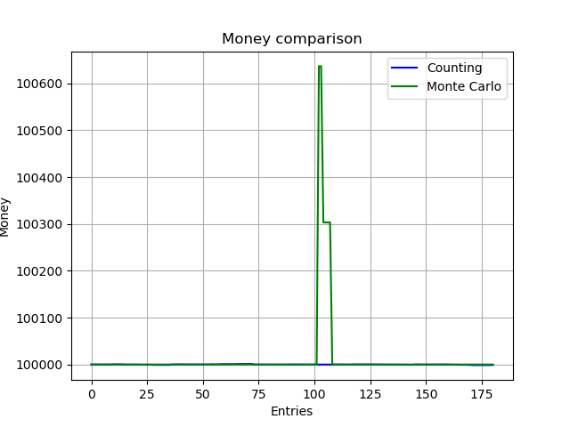
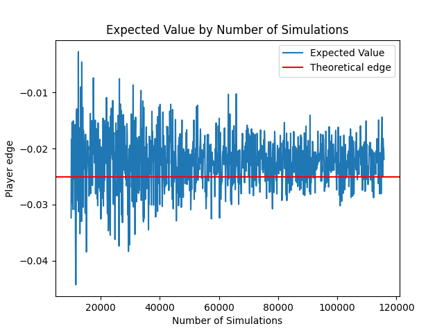

# LetsGoGambling

## Contents

1. [Blackjack](#Blackjack)
2. [Playing Strategy](#Playing-Strategy)
3. [Chernoff-Hoeffding Inequality](#Chernoff-Hoeffding-Inequality)
4. [Monte Carlo](#Monte-Carlo)
5. [Bet sizing](#Bet-sizing)
6. [The Results](#The-Results)
7. [References](#References)

## Blackjack

We will simulate the game of Blackjack with one player and the dealer for simplicity. There will be no additional players in this version.

In our game, the player has only two actions: stand or hit. The outcomes of each game are: lose, win, tie, or blackjack.

- A loss (-1): You lose all the money you bet.
- A win (+1): You gain an amount equal to your bet.
- A tie (0): You neither gain nor lose money.
- A blackjack (1.5): You win 3/2 of your bet.

J, Q, K and worth 10 points, Ace can be either 11 or 1.

Also as long as the dealer has a count value < 17 he HAS to hit.

## Playing Strategy

We only care about hit and stand (double can be either hit or stand) and only
about hard and soft hands.

Our playing strategy dates back to 1950, when the Four Horsemen of the Apocalypse
(a group of U.S. Army engineers) first discovered the optimal playing strategy for Blackjack.

Later, this strategy was refined using computers and combinatorial analysis,
achieving the smallest possible monetary loss in the long run. This strategy
is also known as "The Basic Strategy" in Blackjack.

Below is a guide for the decisions you should make based on your count value and the dealer's upcard:

We focus only on hit and stand decisions (treating double as either hit or stand) and consider only hard and soft hands.

## Chernoff-Hoeffding Inequality

To determine how many simulations our Monte Carlo simulation needs for a reasonable result, we used the Chernoff-Hoeffding Inequality:

$$
P(|S_n - p| < \epsilon) \geq 1 - 2 * \exp {\frac{-2 * n * \epsilon ^ 2}{(1.5 - (-1)) ^ 2}} \Leftrightarrow
$$
$$
\Leftrightarrow n > - \frac {\ln {\frac {1 - \alpha}{2}} * 6.25}{2 * \epsilon ^ 2} \approx 115377
$$

So for an accurate result will need to do 115377 simulations (we used epsilon = 0.01 and p = 0.95).

## Monte Carlo

We are using Monte Carlo to compute the next amount of money we should
bet when we will play on the next hand.

The computation runs a certain amount of simulations by playing a hand
using the "basic strategy" and using the outcomes (Win, Lose, Tie, Blackjack)
to compute the equivalent expected value and variation of that hand.

## Bet sizing

Kelly criterion is a formula for sizing a sequence of bets by maximizing the
long-term expected value of the logarithm of wealth, which is equivalent to
maximizing the long-term expected geometric growth rate

If we were to play Blackjack and we could only lose everything or win the
amount we betted (b >= 1) we could use Kelly criterion to choose our bet size:

$$
f^* = p - \frac{p}{q}
$$

- p is the probability of winning
- q = 1 - p
- b is the proportion of the bet gained for a win

In this case, we would have a random variable that looks like this:

$$
X  \ \textasciitilde \ 
\begin{pmatrix}
b & -1 \\
p & q
\end{pmatrix}
$$

$$
\text{And } f^* = \frac {E[X]}{b}
$$

But in our case a hand of Blackjack looks like this:

$$
X'  \ \textasciitilde \ 
\begin{pmatrix}
1 & 1.5 & 0 & -1 \\
w & j & t & q
\end{pmatrix}
$$

Q5: What is the optimal bet size?
A5: Certainty Equivalent (CE) provides a way to compare different bets.
The bet with the highest CE is the one you want to make, unless all bets have a
negative CE in which case you should not bet at all. For a typical hand of blackjack,
the amount you expect to win, on average, is some advantage "a" times the amount
bet with a variance equal to some value "u" times the square of the amount bet.
To maximize the CE you must maximize

$$CE = ba – (b^2)u / 2kB$$

where "b" is the size of the bet. A very little calculus shows that this is maximized when

$$b = akB / u$$

if "a" is positive. (If "a" is not positive you should bet as little as possible.)
A quick calculation shows that your CE will be negative if you bet more than twice
your optimal bet.
It is better not to bet than to bet more than twice the optimal amount.
Also notice that for an optimal bet the CE is precisely half the expected winnings, E.
This will be discussed in more detail below.

So in this case we will use Ev / Var to choose our bet percentage as it is a good
approximation.

## The Results

Besides the Monte Carlo simulation we have also implemented a High Low counting
strategy to compare the two.

The crux of High Low is the following:
You start your count at 0 if the card dealt is between [2-6] you add +1 if it is
between [7-9] you add 0 and if it is between [10-A] you add -1.

In the beginning the High-Low counting seems to have a better result, while the
Monte Carlo simulation seems to lose more money, but if we play more matches
in the long run Monte Carlo will catch up and will actually be better.

We can see that as we move close and beyond our number of simulations
115377 we are getting closer and closer to the desired edge whereas in the beginning
we were further apart.

## References

- https://wizardofodds.com/gambling/kelly-criterion/
- https://www.blackjackreview.com/wp/archives/red-taylor-kelly-criterion-faq/
- https://graphics.stanford.edu/~billyc/class/vis_win0304/as2/
- https://i.bojoko.com/25/c7e2777d_1000x1330.876e5ac5f344d22c4b27d59d1b8ae5d8/blackjack-basic-strategy-chart.png
- https://en.wikipedia.org/wiki/Kelly_criterion
